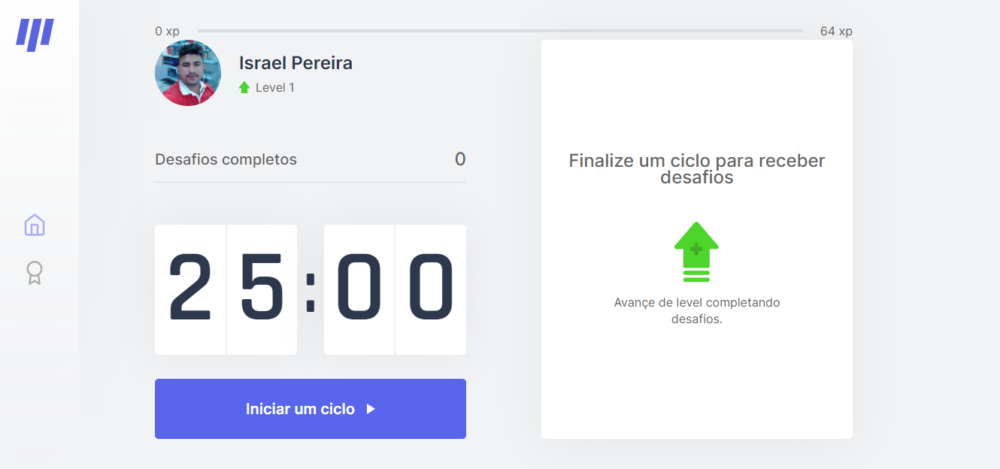

<h1 align="center">
  
  <br />
  4th Next Level Week
</h1>

<p align="center">
  <a href="#gear-technologies">Technologies</a>&nbsp;&nbsp;&nbsp;|&nbsp;&nbsp;&nbsp;
  <a href="#gear-technologies">Technologies</a>&nbsp;&nbsp;&nbsp;|&nbsp;&nbsp;&nbsp;
  <a href="#computer-how-to-run">How to run</a>
</p>

<p align="center">
 

  
</p>

<br>

<p align="center">
  
</p>


---

## 🚀 Technologies

This project was developed during Next Level Week #4 (reactjs trail) with the following technologies:

  - [ReactJS](https://reactjs.org/)
  - [NextJS](https://nextjs.org/)
  - [js-cookie](https://github.com/js-cookie/js-cookie)
  - [Typescript][ts]

## 💻 Computer: How to run

  ```bash
    # clone repository
    git clone https://github.com/israel206/mover.it.git project-name

    # enter web folder
    cd project-name

    # download dependencies
    yarn

    # running web project
    yarn dev
  ```
---
## 👨‍💻 Licença

Esse projeto está sob a licença MIT. Veja o arquivo [LICENSE](LICENSE.md) para mais detalhes.

---

Feito com ♥ acompanhado as aulas da Rocketseat da 4th Next Level Week

[ts]: https://www.typescriptlang.org
[vscode]: https://code.visualstudio.com/
[yarn]: https://yarnpkg.com/
[vceditconfig]: https://marketplace.visualstudio.com/items?itemName=EditorConfig.EditorConfig
[vceslint]: https://marketplace.visualstudio.com/items?itemName=dbaeumer.vscode-eslint